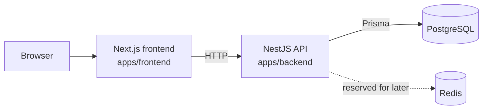

# Current Architecture

**Phase:** 0 - Foundations  
**Last updated:** 2026-07-28

This document describes the architecture implemented in the repository today.

## System Diagram

## Implemented Boundaries

### Frontend

- Lives in `apps/frontend`
- Next.js App Router application
- Renders a simple incident dashboard
- Calls the backend directly through `NEXT_PUBLIC_API_URL`
- Holds UI state and form interactions only

### Backend

- Lives in `apps/backend`
- NestJS modular monolith
- Current modules:
  - `HealthModule`
  - `IncidentsModule`
  - `PrismaModule`
- Owns validation, request handling, and persistence orchestration

### Data layer

- PostgreSQL is the system of record
- Prisma is the only ORM and schema authority
- Redis is provisioned in local infrastructure but is not part of the live request path yet

## Current Data Flow

1. User loads the Next.js app.
2. The frontend fetches incidents from the Nest API.
3. The API validates input and talks to Postgres through Prisma.
4. The frontend renders incident data and can create new incidents.

## Module Responsibilities

| Module | Responsibility |
| --- | --- |
| `apps/frontend/app/page.tsx` | Incident list and create UI |
| `apps/backend/src/health` | Liveness and DB connectivity |
| `apps/backend/src/incidents` | Incident HTTP surface and application logic |
| `apps/backend/src/prisma` | Prisma client lifecycle and access |
| `apps/backend/prisma/schema.prisma` | Database schema and tenancy shape |

## External Integrations

| Integration | Status | Purpose |
| --- | --- | --- |
| PostgreSQL | Active | Persist incidents |
| Redis | Provisioned, unused | Reserved for BullMQ and async workflows |

## Tenancy

Soft multi-tenancy exists from day one through `organization_id`.

- MVP uses `org_default`
- No authentication is implemented yet
- New tenant-owned tables should keep the same shape unless an ADR changes it

## Explicitly Not Built Yet

- Auth
- Async ingest and queues
- AI summary workflows
- WebSockets
- Kafka
- Kubernetes
- Shared internal packages
- Microservices

For planned evolution, see `target.md`. For product scope, see `../product/MVP.md`.
