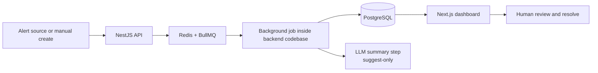

# Target Architecture

This document describes the intended next-stage architecture, not the full end-state dream.

The goal is to evolve only as product milestones require.

## Near-Term Target

The next meaningful architecture step is the MVP workflow:

## Intended Boundaries

### Frontend

- Dashboard and workflow UI
- Presents AI output clearly as a suggestion
- Should not contain business rules that duplicate backend decisions

### Backend

- Remains a modular monolith through MVP
- Gains clearer domain boundaries around incidents, ingest, and AI summarization
- Owns orchestration for validation, persistence, and async workflows

### Queue and workers

- Introduce BullMQ only when alert ingest starts
- Keep workers in the same repository and same deployable boundary until operational pressure justifies a split

### AI integration

- Use a single summarization path first
- Structured output only
- Human review required
- Prompt versions should be explicit and reviewable

## Evolution Rules

- Add shared `packages/` only after real duplication appears twice
- Add auth before any shared or public deployment
- Consider service extraction only if scaling, ownership, or deployment pressure becomes real
- Record non-trivial shifts in `docs/decisions/`

## Intentionally Deferred

These are not target requirements for the current phase:

- Microservices
- Kafka
- Kubernetes
- Multi-agent orchestration
- RAG and knowledge graph infrastructure
- Complex event buses

Those belong in later chapters only if product or operational signals justify them.
